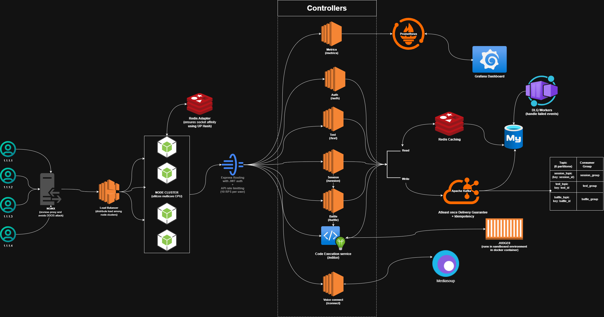

# Codemint 
> Monolith Architechture

Codemint is a scalable, real-time collaborative coding platform designed for **pair programming**, **competitive coding duels**, and **secure, proctored online assessments (OAs)**. The platform emphasizes **event-driven architecture**, **low-latency communication**, and **production-grade scalability and observability**.

---

## Features

- Real-time collaborative coding sessions
- Competitive coding duels between users
- Timed and proctored online assessments
- JWT-based secure authentication and authorization
- Live updates using WebSockets (Socket.IO)
- Event-driven, fault-tolerant backend processing
- Metrics, monitoring, and observability

---

## Technology Stack

### Frontend
- React
- Socket.IO Client

### Backend
- Node.js
- Express.js
- Socket.IO
- JWT Authentication

### Database and Caching
- MySQL (primary relational datastore)
- Redis (clustered) for caching and socket affinity

### Messaging and Architecture
- Apache Kafka
  - Event-based communication
  - Backpressure handling
  - Retry mechanisms
  - Dead Letter Queue (DLQ) for failed events

### Scalability and Reliability
- Node.js clustering for efficient CPU utilization
- Redis-based socket affinity for real-time connections
- Horizontal scalability with cluster-aware design

### Monitoring and Observability
- Prometheus for metrics collection
- Grafana for dashboards and visualization

---

## Architecture Overview

Codemint currently follows a **monolithic architecture**, internally organized using **event-driven design principles** to ensure scalability and loose coupling.

Key architectural aspects:
- Decoupled internal modules communicating via Kafka events
- Stateless API layer with Redis-backed session and socket management
- Cluster-aware real-time communication using Socket.IO
- Reliable message processing with retries and DLQ support

---

## Database Schema

---

## System Design (Monolithic – High Level)

---

## Application Screenshots

> Current UI version. Visual and UX improvements are in progress.

---

## Upcoming Enhancements

- AI-powered plagiarism detection during online assessments using YOLOS
- WebRTC-based audio and video support for collaboration and proctoring
- Load balancing and auto-scaling infrastructure
- API rate limiting for abuse prevention and fair usage enforcement

---

## Engineering Highlights

- Event-driven architecture using Apache Kafka for scalability and fault tolerance
- Redis clustering for high-performance real-time communication
- Node.js clustering to maximize resource utilization
- Backpressure-aware event consumers with retry logic
- Dead Letter Queues to isolate and analyze failed events
- Production-grade monitoring with Prometheus and Grafana

---

## Challenges I faced and how I solved them

- When I try to utilize all CPU cores by Node clustering, the socket connections started to break or the event werent sending msg at all. Solved it by integrating Redis Sticky Sessions.
- Earlier the code used to sync into DB just after the update in editor, it lead to lagging in UI and DB crash. Fixed it by adding debouncing in UI and event based DB updates using Kafka
