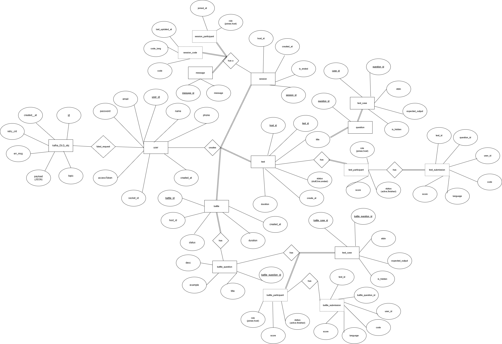

# Codemint
- Collaborative coding platform where you can conduct coding sessions with people you want to collaborate with, duel battle wit friends or conduct timed and proctored OA (online assessment)
- NodeJS(backend), React(Frontend), Databse: MySQL, Messaging Queue: apache kafka, architecture: event_based architecture, JWT secure auth, Socket.io for real time updates, Redis-clustering for socket affinity, scaled using Node clustering, backpressure and retry logic support for cluster nodes, DLQ to handle failed events
- Upcoming changes im working upon: YOLOS(AI powered plagiarism detection during OAs), WebRTC integration to enable audo-video support too, Load balancing and auto scaling, rate limitter
## DB Schema

## System Design (rough, will improve eventually)

## Some current version screenshots(will improve in future)

