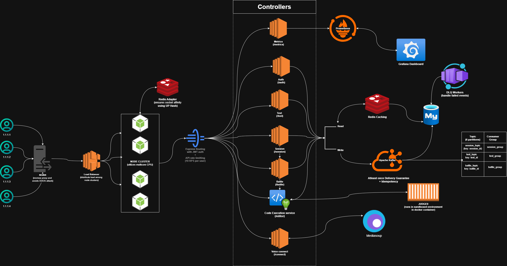

## Whats added in v3?
- Now u can also talk over voice in sessions and code duels
- Host can mute joinees anytime
- I first used WebRTC, but found that its not efficient for group voice calls, so i switched to mediasoup using SFU architecture.
- NOTE: DevTunnel is used for local development and voice calls will work there coz it relies purely upon TCP connections and they rule out all UDP connections thats requeired for Mediasoup, for production v need to host it on a server that supports UDP.
- Added 3 topics mapped to 3 consumer groups, each for session,battle and test along with adding partitions and increased performance 
## New Architecture
<>