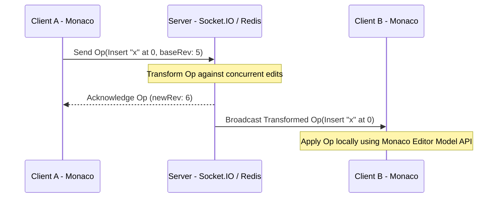

# What changes in v6
- Current architecture is based on `Last write wins` strategy, implemented using Redis and kafka, decoupling DB writes from changes
- But, the cursor in monaco editor keeps jumping(especially when the user types very fast)
- This happens becoz, tho the DB writes are decoupled, still each sender emits their entire code to the receiver, the receiver needs to replace entire code with new one, even for a small change in the code, leading to cursor jumping

- The solution is to use Operational Transformation (OT)
### How Operational Transformation (OT) Works
Instead of sending the whole file, clients send only the **operations** (incremental edits). An operation consists of three basic actions:
* `Insert(position, text)`
* `Delete(position, length)`
* `Retain(length)` (moves the cursor forward without modifying)

When Client A and Client B concurrently edit the document, the server receives both operations and **transforms** them so they converge on the same text.
For example, if the document is `"abc"`:
* Client A inserts `"x"` at index 0 $\rightarrow$ `opA = Insert(0, "x")` $\rightarrow$ final text `"xabc"`
* Client B inserts `"y"` at index 3 $\rightarrow$ `opB = Insert(3, "y")` $\rightarrow$ final text `"abcy"`

If the server receives `opA` first, it transforms `opB` to account for `opA`'s insertion (shifting the insertion index of `opB` by +1 to index 4). The transformed operation `opB'` is applied to get `"xabcy"`.

---

### Implementation of Changes

```mermaid
sequenceDiagram
    participant A as Client A - Monaco
    participant S as Server - Socket.IO / Redis
    participant B as Client B - Monaco

    A->>S: Send Op(Insert "x" at 0, baseRev: 5)
    Note over S: Transform Op against concurrent edits
    S-->>A: Acknowledge Op (newRev: 6)
    S->>B: Broadcast Transformed Op(Insert "x" at 0)
    Note over B: Apply Op locally using Monaco Editor Model API
```

#### 1. Client-Side Changes (UI)
* **Editor Integration**: Instead of sending code changes on simple keystrokes, listen to the raw changes of the code editor (e.g., Monaco Editor's `onDidChangeModelContent`). Monaco provides an event containing an array of `changes` with `range`, `rangeLength`, and `text`.
* **OT Client Lifecycle**: Implement an OT client engine (often using the `ot.js` library). The client must track:
  1. `revision`: The server-confirmed document revision index.
  2. `pendingOp`: The operation currently sent to the server awaiting an acknowledgment.
  3. `bufferOp`: Operations the user performed locally while waiting for the server's ack.
* When the server acknowledges a sent operation, the client sends its buffered operations next.

#### 2. Server-Side Changes (`backend`)
* **Document History Tracking**: In [session.controller.js](.backend/controller/session.controller.js), maintain a history log of operations and the current revision number in Redis for every active session.
* **Transformation Logic**:
  When the server receives an operation `op` at base revision `clientRev`:
  1. If `clientRev === serverRev` (no concurrent edits), apply `op` to the document in Redis, increment `serverRev`, and broadcast `op` to other participants.
  2. If `clientRev < serverRev` (concurrent edits occurred), the server transforms `op` against all operations in the history log from `clientRev` to `serverRev`. Apply the transformed operation `op'`, increment `serverRev`, save it to the history log, broadcast `op'`, and send an acknowledgment back to the sender.

#### 3. Database Caching Changes
* The periodic Kafka database updates will write the current consolidated text string from the Redis state to MySQL, keeping the database writes decoupled from the WebSocket operational throughput.

---
- BUt , implementing OT can be very hard since it involves advanced math and multiple edge cases
- So, I hv opted for `CRDT (Conflict-free Replicated Data Type)` via Yjs,  where edits are broadcast as lightweight conflict-free operational changes (CRDT updates) applied directly to Monaco Editor's document model, keeping cursors and selections fully intact
- Socket.IO Event Migration: Custom full-text event synchronization (host_code_change, joinee_code_change, host_code_update, etc.) will be replaced with binary yjs-sync-step-1, yjs-sync-step-2, and yjs-update event structures.
State Preservation: The document state will be cached in Redis as a binary snapshot of the Yjs document. The debounced write-back caching to MySQL via Kafka remains intact by extracting the raw string from the Yjs document on the server before writing.
## Proposed Changes

### 1. Backend

#### [MODIFY] [package.json](.backend/package.json)
- Add `yjs` dependency.

#### [MODIFY] [session.controller.js](.backend/controller/session.controller.js)
- Import `yjs` (as `* as Y`).
- Implement helper class `SessionYDocManager` to manage in-memory `Y.Doc` instances for active sessions:
  - Load binary snapshot from Redis when a session starts.
  - Listen to document updates and schedule debounced writes of the plain text to MySQL via Kafka.
  - Save binary snapshots to Redis.
- Replace custom `host_code_change` and `joinee_code_change` socket event handlers with:
  - `yjs-sync-step-1`: Receives client state vector, replies with step-2 updates, and requests missing client updates.
  - `yjs-update`: Receives binary increments and applies them to the server-side `Y.Doc`.
- Ensure cleanups on disconnect flush the final document text.

---

### 2. Frontend (UI)

#### [MODIFY] [package.json](.ui/package.json)
- Add `yjs` and `y-monaco` dependencies.

#### [MODIFY] [CodeEditor.jsx](.ui/src/pages/CodeEditor.jsx)
- Import `yjs` and `MonacoBinding` from `y-monaco`.
- Support optional `yDocText` or `yDoc` and `socket` props:
  - If collaborative editing is enabled, bind Monaco editor model to the Yjs `Y.Text` object using `MonacoBinding`.
  - Disable standard controlled-value updates to prevent buffer replacement when Yjs is active.

#### [MODIFY] [HostView.jsx](./ui/src/pages/HostView.jsx) and [JoineeView.jsx](./ui/src/pages/JoineeView.jsx)
- Initialize/maintain a local Yjs document (`Y.Doc`) synced over the socket.
- Pass the Yjs document state to `CodeEditor` to enable collaborative editing.

---

