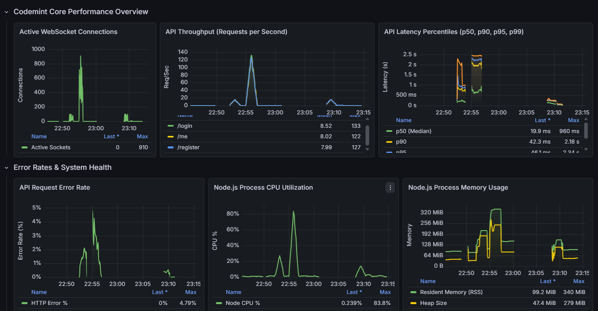

# Whats added in v4?
## Before: 
- Tests (load and web socket) are added into this version with same architecture, to understand how system breathes under various loads
- sample test script `k6 run --vus 10 --duration 10s backend/test/stress_test.js` for 10 VUs

- Environment Summary

| Parameter                       | Value            |
| ------------------------------- | ---------------- |
| Tool                            | k6               |
| Protocols Tested                | HTTP + WebSocket |
| Authentication Tested           | Yes              |
| Profile API Tested              | Yes              |
| WebSocket Upgrade Tested        | Yes              |
| Test Machine                    | Windows          |
| Test Duration Variants          | 10s and 1m       |
| Maximum Concurrent Users Tested | 500 VUs          |

---

##  Comparative Performance Analysis

| Metric              | 10 VUs    | 100 VUs   | 500 VUs   |
| ------------------- | --------- | --------- | --------- |
| Avg Response Time   | 68 ms     | 99 ms     | 167 ms    |
| P95 Latency         | 143 ms    | 244 ms    | 690 ms    |
| Failure Rate        | 0%        | 0%        | 4.77%     |
| Max Response Time   | 146 ms    | 356 ms    | 960 ms    |
| WebSocket Stability | Excellent | Excellent | Excellent |

---

## Key Findings
- System handled upto 100 concurrent users very efficiently
- however, system struggled, especially in authentication part having 10 hash rounds to generate JWT token when tested against 500 VUs
- I reduced the number of rounds to 4, it helped, but only a little
- In all cases system efficiently handled socket connections efficiently
# After (Current Version):
- **Redis-based Token & Session Caching**:
  - Verification results are hashed and cached in Redis. Sub-sequent HTTP API requests bypass the CPU-heavy cryptographic verification `jwt.verify`.
  - WebSocket handshakes check the Redis token cache first. Hit path bypasses BOTH cryptographic verify and the `SELECT user_id, name, email FROM user` database lookup entirely.
  - User profiles are cached in Redis for 1 hour, reducing MySQL read pressure on login and token refresh.
- **Database Index Optimization**:
  - Implemented automatic startup index provisioning. The database automatically creates safe indexes for `test_submissions`, `battle_submissions`, `messages`, and `kafka_dlq`.

# CodeMint Backend — Final 100 VUs Comparison

## Previous vs Intermediate vs Latest Optimized

| Metric               | Original 100 VUs | Intermediate Optimized | Latest Optimized | Final Status           |
| -------------------- | ---------------- | ---------------------- | ---------------- | ---------------------- |
| Failure Rate         | 0.00%            | 2.32%                  | 0.39%            | ✅ Huge improvement     |
| Avg Response Time    | 99.3ms           | 317ms                  | 127ms            | ✅ Nearly recovered     |
| Median Response Time | 90ms             | 232ms                  | 129ms            | ✅ Much better          |
| P90 Latency          | 210ms            | 717ms                  | 230ms            | ✅ Almost identical     |
| P95 Latency          | 244ms            | 931ms                  | 253ms            | ✅ Nearly restored      |
| Max Response Time    | 356ms            | 1.72s                  | 338ms            | ✅ Better than original |
| Total Requests       | 3000             | 2835                   | 3012             | ✅ Highest throughput   |
| Iterations           | 1000             | 956                    | 1006             | ✅ Improved             |
| Auth Success Rate    | 100%             | 96%                    | 99.4%            | ✅ Nearly perfect       |
| WebSocket Stability  | Excellent        | Excellent              | Excellent        | ✅ Stable               |

---

## WebSocket Performance

Your WebSocket subsystem is consistently excellent.

Notable metrics:

| Metric              | Result    |
| ------------------- | --------- |
| Avg WS Connect Time | 9ms       |
| P95 WS Connect      | 29ms      |
| Session Stability   | Excellent |
| Upgrade Failures    | 0         |

